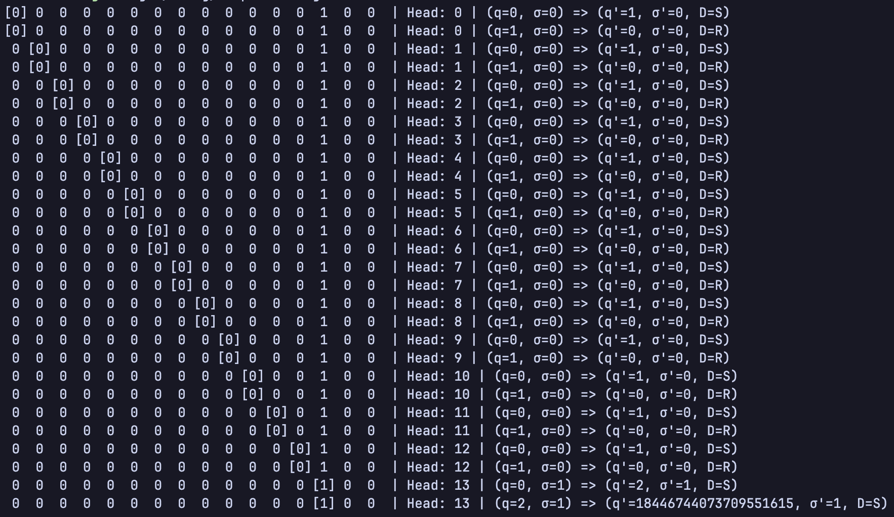

[](https://github.com/Zitronenjoghurt/simple-turing-machine/actions/workflows/rust.yml)
[](https://codecov.io/gh/Zitronenjoghurt/simple-turing-machine)


# simple-turing-machine
A simple turing machine written in Rust. I'll see where this will take me xD

# Examples
## Move right till you reach a marked field
```rust
let mut compiler = TuringCompiler::default();
let check_if_marked = compiler.allocate_state();
let move_to_next = compiler.allocate_state();
let found_mark = compiler.allocate_state();

compiler.branch(Some(check_if_marked), found_mark, move_to_next);
compiler.move_right(Some(move_to_next), Some(check_if_marked));
compiler.halt(Some(found_mark));

let program = compiler.get_program();
```
