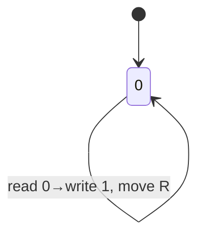
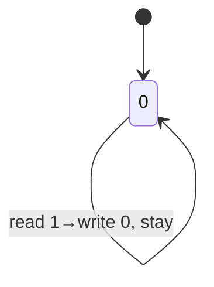
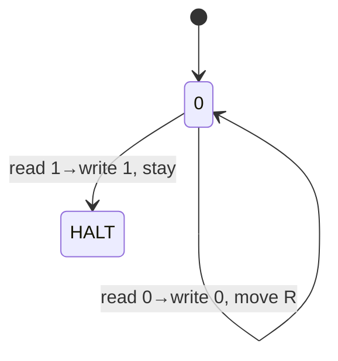
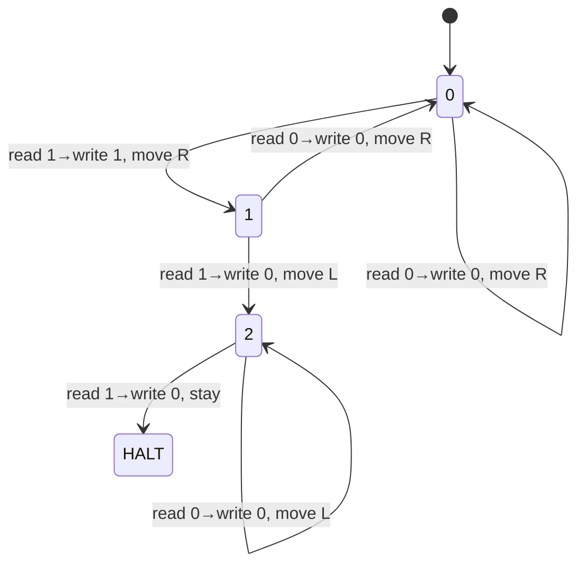

[](https://github.com/Zitronenjoghurt/simple-turing-machine/actions/workflows/rust.yml)
[](https://codecov.io/gh/Zitronenjoghurt/simple-turing-machine)


# simple-turing-machine
A simple turing machine written in Rust. I'll see where this will take me xD

# What is a Turing Machine?
Conceptually, a turing machine is some kind of arbitrary machine with an infinitely long tape of symbols. It has a head which it is able to move left and right on the tape. And it can read and write a symbol from/to the current head position.\
The cool thing about this is that these functionalities are enough for the turing machine to (theoretically) be able to execute ANY possible(!) program.

The turing machine is always in a unique state, and is always reading a symbol (in my case its either 0 or 1, because that's the alphabet I chose).\
An instruction for the turing machine is described by a state transition function which takes in the current state (q∈N), the symbol at its head (σ∈{0,1}) and outputs the next state (q'∈N), the symbol to write (σ'∈{0,1}) and the direction to move the head to (D∈{L,R,S}).

Example 1:\
(q=0, σ=0) => (q'=0, σ'=1, D=R)\
If the turing machine is in state 0 and is currently reading a 0, it will now move to state 0, write a 1, then move right. This will actually result in an endless loop which will continuously go right and essentially write 1s forever.


Example 2:\
(q=0, σ=0) => (q'=0, σ'=1, D=S)\
(q=0, σ=1) => (q'=0, σ'=0, D=S)\
D=S stands for 'stand', so the head won't move in any direction. It essentially makes the bit at the current position switch between 0 and 1 endlessly.


Example 3:\
(q=0, σ=0) => (q'=0, σ'=0, D=R)\
(q=0, σ=1) => (q'=HALT, σ'=1, D=S)\
This will make the head move right until it finds a 1 and halts. In my implementation a HALT will be triggered if the current instruction transitions to the biggest representable state (on a 64-bit machine that's 2^64 - 1, `usize::MAX`).


Example 4:\
(q=0, σ=0) => (q'=0, σ'=0, D=R)\
(q=0, σ=1) => (q'=1, σ'=1, D=R)\
(q=1, σ=0) => (q'=0, σ'=0, D=R)\
(q=1, σ=1) => (q'=2, σ'=0, D=L)\
(q=2, σ=0) => (q'=2, σ'=0, D=L)\
(q=2, σ=1) => (q'=HALT, σ'=0, D=S)\
This will make the head search for the first 2 consecutive 1s and then overwrite them with 0s.


# Compiler Examples
## Mark a field first, reset head, then move right till you reach a marked field
```rust
let mut compiler = TuringCompiler::default();

let move_right_x = compiler.allocate_state();
let set_one = compiler.allocate_state();
let move_left_x = compiler.allocate_state();
let scan_start = compiler.allocate_state();
let done = compiler.allocate_state();

compiler.move_right_x(13, Some(move_right_x), Some(set_one));
compiler.mark(Some(set_one), Some(move_left_x));
compiler.move_left_x(13, Some(move_left_x), Some(scan_start));
compiler.scan_single(true, Movement::Right, Some(scan_start), Some(done));
compiler.halt(Some(done));

compiler.get_program()
```
```
[0] 0  0  0  0  0  0  0  | Head: 0 | (q=0, σ=0) => (q'=5, σ'=0, D=R)
 0 [0] 0  0  0  0  0  0  | Head: 1 | (q=5, σ=0) => (q'=6, σ'=0, D=R)
 0  0 [0] 0  0  0  0  0  | Head: 2 | (q=6, σ=0) => (q'=7, σ'=0, D=R)
 0  0  0 [0] 0  0  0  0  | Head: 3 | (q=7, σ=0) => (q'=8, σ'=0, D=R)
 0  0  0  0 [0] 0  0  0  | Head: 4 | (q=8, σ=0) => (q'=9, σ'=0, D=R)
 0  0  0  0  0 [0] 0  0  | Head: 5 | (q=9, σ=0) => (q'=10, σ'=0, D=R)
 0  0  0  0  0  0 [0] 0  | Head: 6 | (q=10, σ=0) => (q'=11, σ'=0, D=R)
 0  0  0  0  0  0  0 [0] | Head: 7 | (q=11, σ=0) => (q'=12, σ'=0, D=R)
 0  0  0  0  0  0  0  0 [0] 0  0  0  0  0  0  0  | Head: 8 | (q=12, σ=0) => (q'=13, σ'=0, D=R)
 0  0  0  0  0  0  0  0  0 [0] 0  0  0  0  0  0  | Head: 9 | (q=13, σ=0) => (q'=14, σ'=0, D=R)
 0  0  0  0  0  0  0  0  0  0 [0] 0  0  0  0  0  | Head: 10 | (q=14, σ=0) => (q'=15, σ'=0, D=R)
 0  0  0  0  0  0  0  0  0  0  0 [0] 0  0  0  0  | Head: 11 | (q=15, σ=0) => (q'=16, σ'=0, D=R)
 0  0  0  0  0  0  0  0  0  0  0  0 [0] 0  0  0  | Head: 12 | (q=16, σ=0) => (q'=1, σ'=0, D=R)
 0  0  0  0  0  0  0  0  0  0  0  0  0 [0] 0  0  | Head: 13 | (q=1, σ=0) => (q'=2, σ'=1, D=S)
 0  0  0  0  0  0  0  0  0  0  0  0  0 [1] 0  0  | Head: 13 | (q=2, σ=1) => (q'=17, σ'=1, D=L)
 0  0  0  0  0  0  0  0  0  0  0  0 [0] 1  0  0  | Head: 12 | (q=17, σ=0) => (q'=18, σ'=0, D=L)
 0  0  0  0  0  0  0  0  0  0  0 [0] 0  1  0  0  | Head: 11 | (q=18, σ=0) => (q'=19, σ'=0, D=L)
 0  0  0  0  0  0  0  0  0  0 [0] 0  0  1  0  0  | Head: 10 | (q=19, σ=0) => (q'=20, σ'=0, D=L)
 0  0  0  0  0  0  0  0  0 [0] 0  0  0  1  0  0  | Head: 9 | (q=20, σ=0) => (q'=21, σ'=0, D=L)
 0  0  0  0  0  0  0  0 [0] 0  0  0  0  1  0  0  | Head: 8 | (q=21, σ=0) => (q'=22, σ'=0, D=L)
 0  0  0  0  0  0  0 [0] 0  0  0  0  0  1  0  0  | Head: 7 | (q=22, σ=0) => (q'=23, σ'=0, D=L)
 0  0  0  0  0  0 [0] 0  0  0  0  0  0  1  0  0  | Head: 6 | (q=23, σ=0) => (q'=24, σ'=0, D=L)
 0  0  0  0  0 [0] 0  0  0  0  0  0  0  1  0  0  | Head: 5 | (q=24, σ=0) => (q'=25, σ'=0, D=L)
 0  0  0  0 [0] 0  0  0  0  0  0  0  0  1  0  0  | Head: 4 | (q=25, σ=0) => (q'=26, σ'=0, D=L)
 0  0  0 [0] 0  0  0  0  0  0  0  0  0  1  0  0  | Head: 3 | (q=26, σ=0) => (q'=27, σ'=0, D=L)
 0  0 [0] 0  0  0  0  0  0  0  0  0  0  1  0  0  | Head: 2 | (q=27, σ=0) => (q'=28, σ'=0, D=L)
 0 [0] 0  0  0  0  0  0  0  0  0  0  0  1  0  0  | Head: 1 | (q=28, σ=0) => (q'=3, σ'=0, D=L)
[0] 0  0  0  0  0  0  0  0  0  0  0  0  1  0  0  | Head: 0 | (q=3, σ=0) => (q'=3, σ'=0, D=R)
 0 [0] 0  0  0  0  0  0  0  0  0  0  0  1  0  0  | Head: 1 | (q=3, σ=0) => (q'=3, σ'=0, D=R)
 0  0 [0] 0  0  0  0  0  0  0  0  0  0  1  0  0  | Head: 2 | (q=3, σ=0) => (q'=3, σ'=0, D=R)
 0  0  0 [0] 0  0  0  0  0  0  0  0  0  1  0  0  | Head: 3 | (q=3, σ=0) => (q'=3, σ'=0, D=R)
 0  0  0  0 [0] 0  0  0  0  0  0  0  0  1  0  0  | Head: 4 | (q=3, σ=0) => (q'=3, σ'=0, D=R)
 0  0  0  0  0 [0] 0  0  0  0  0  0  0  1  0  0  | Head: 5 | (q=3, σ=0) => (q'=3, σ'=0, D=R)
 0  0  0  0  0  0 [0] 0  0  0  0  0  0  1  0  0  | Head: 6 | (q=3, σ=0) => (q'=3, σ'=0, D=R)
 0  0  0  0  0  0  0 [0] 0  0  0  0  0  1  0  0  | Head: 7 | (q=3, σ=0) => (q'=3, σ'=0, D=R)
 0  0  0  0  0  0  0  0 [0] 0  0  0  0  1  0  0  | Head: 8 | (q=3, σ=0) => (q'=3, σ'=0, D=R)
 0  0  0  0  0  0  0  0  0 [0] 0  0  0  1  0  0  | Head: 9 | (q=3, σ=0) => (q'=3, σ'=0, D=R)
 0  0  0  0  0  0  0  0  0  0 [0] 0  0  1  0  0  | Head: 10 | (q=3, σ=0) => (q'=3, σ'=0, D=R)
 0  0  0  0  0  0  0  0  0  0  0 [0] 0  1  0  0  | Head: 11 | (q=3, σ=0) => (q'=3, σ'=0, D=R)
 0  0  0  0  0  0  0  0  0  0  0  0 [0] 1  0  0  | Head: 12 | (q=3, σ=0) => (q'=3, σ'=0, D=R)
 0  0  0  0  0  0  0  0  0  0  0  0  0 [1] 0  0  | Head: 13 | (q=3, σ=1) => (q'=4, σ'=1, D=S)
 0  0  0  0  0  0  0  0  0  0  0  0  0 [1] 0  0  | Head: 13 | (q=4, σ=1) => (q'=18446744073709551615, σ'=1, D=S)
```